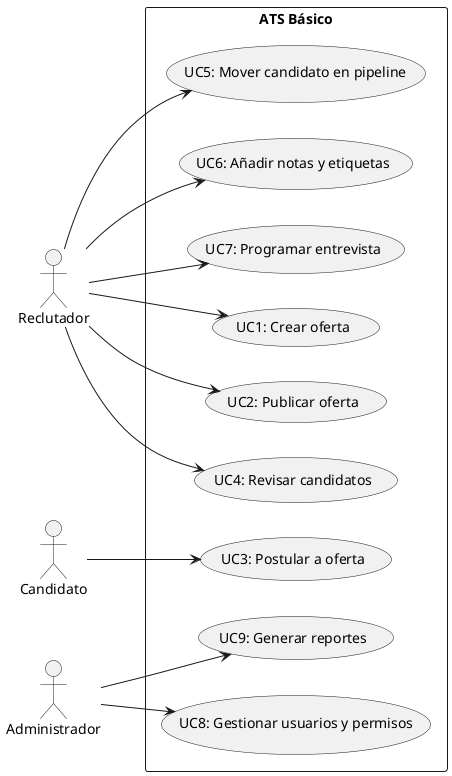

# Prompt 4 - Casosos de Uso

Genera una lista completa de casos de uso para un ATS básico. Incluye actores (reclutador, candidato, administrador), precondiciones, flujo principal y alternativo, y resultado esperado. Presenta los casos en código PlantUML
***

Aquí tienes una lista completa de **casos de uso para un ATS básico**, expresada en **PlantUML** para que puedas generar diagramas fácilmente:

***

### **Código PlantUML**

***

### **Detalle de cada caso de uso**

#### **UC1: Crear oferta**

*   **Actor**: Reclutador
*   **Precondición**: Usuario autenticado con permisos de creación.
*   **Flujo principal**:
    1.  Reclutador accede a “Ofertas”.
    2.  Selecciona “Crear nueva oferta”.
    3.  Completa título, descripción, requisitos.
    4.  Guarda la oferta en estado “Borrador”.
*   **Flujo alternativo**:
    *   Si falta información obligatoria, el sistema muestra error.
*   **Resultado esperado**: Oferta creada y visible en la lista interna.

***

#### **UC2: Publicar oferta**

*   **Actor**: Reclutador
*   **Precondición**: Oferta en estado “Borrador”.
*   **Flujo principal**:
    1.  Reclutador selecciona oferta.
    2.  Hace clic en “Publicar”.
    3.  Sistema valida datos y publica en portal interno.
*   **Flujo alternativo**:
    *   Error si no hay permisos o falta información.
*   **Resultado esperado**: Oferta visible para candidatos.

***

#### **UC3: Postular a oferta**

*   **Actor**: Candidato
*   **Precondición**: Oferta publicada.
*   **Flujo principal**:
    1.  Candidato accede a la oferta.
    2.  Completa formulario y adjunta CV.
    3.  Envía postulación.
*   **Flujo alternativo**:
    *   Error si faltan datos o archivo CV.
*   **Resultado esperado**: Postulación registrada en el ATS.

***

#### **UC4: Revisar candidatos**

*   **Actor**: Reclutador
*   **Precondición**: Existen postulaciones.
*   **Flujo principal**:
    1.  Reclutador accede a lista de candidatos.
    2.  Filtra por oferta o estado.
    3.  Abre ficha del candidato.
*   **Resultado esperado**: Información completa visible.

***

#### **UC5: Mover candidato en pipeline**

*   **Actor**: Reclutador
*   **Precondición**: Candidato en pipeline.
*   **Flujo principal**:
    1.  Reclutador arrastra candidato a nueva etapa.
    2.  Sistema actualiza estado.
*   **Resultado esperado**: Pipeline actualizado.

***

#### **UC6: Añadir notas y etiquetas**

*   **Actor**: Reclutador
*   **Precondición**: Ficha de candidato abierta.
*   **Flujo principal**:
    1.  Reclutador escribe nota o añade etiqueta.
    2.  Guarda cambios.
*   **Resultado esperado**: Información colaborativa registrada.

***

#### **UC7: Programar entrevista**

*   **Actor**: Reclutador
*   **Precondición**: Candidato en etapa “Entrevista”.
*   **Flujo principal**:
    1.  Reclutador selecciona fecha y hora.
    2.  Sistema envía invitación al candidato.
*   **Resultado esperado**: Entrevista agendada.

***

#### **UC8: Gestionar usuarios y permisos**

*   **Actor**: Administrador
*   **Precondición**: Usuario autenticado como admin.
*   **Flujo principal**:
    1.  Admin accede a configuración.
    2.  Añade o modifica roles.
*   **Resultado esperado**: Permisos actualizados.

***

#### **UC9: Generar reportes**

*   **Actor**: Administrador
*   **Precondición**: Datos disponibles.
*   **Flujo principal**:
    1.  Admin selecciona tipo de reporte.
    2.  Sistema genera archivo.
*   **Resultado esperado**: Reporte descargable.
