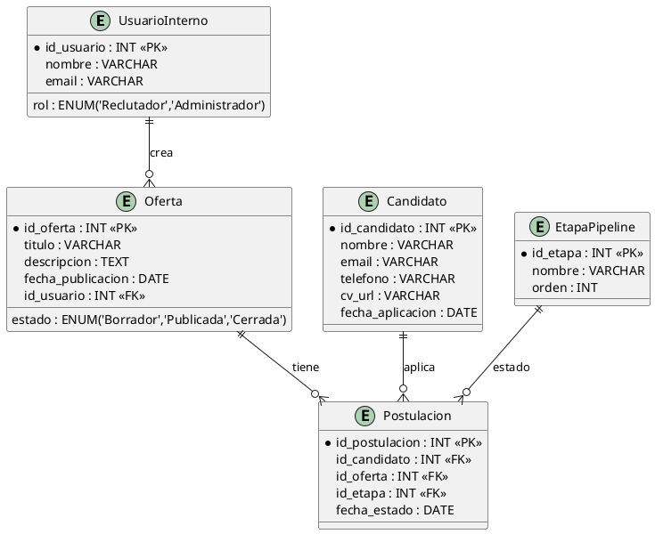

#  Prompt 5 - Modelado de Datos

Diseña el modelo de datos para un ATS que gestione candidatos, ofertas, etapas del proceso y usuarios internos. Incluye entidades, atributos, relaciones (1:N, N:M), claves primarias y foráneas. Sugiere optimizaciones para búsquedas rápidas y filtrado avanzado. Dame el código PlantUML para el diseño
***
Aquí tienes el **modelo de datos para un ATS básico**, incluyendo entidades, atributos, relaciones y optimizaciones, expresado en **PlantUML**:

***

### ✅ **Diseño conceptual del modelo**

**Entidades principales**:

*   **UsuarioInterno**: Reclutadores, administradores.
    *   `id_usuario` (PK), `nombre`, `email`, `rol`.
*   **Oferta**: Puestos publicados.
    *   `id_oferta` (PK), `titulo`, `descripcion`, `estado`, `fecha_publicacion`, `id_usuario` (FK → UsuarioInterno).
*   **Candidato**: Personas que aplican.
    *   `id_candidato` (PK), `nombre`, `email`, `telefono`, `cv_url`, `fecha_aplicacion`.
*   **EtapaPipeline**: Etapas del proceso.
    *   `id_etapa` (PK), `nombre`, `orden`.
*   **Postulacion**: Relación N:M entre Candidato y Oferta.
    *   `id_postulacion` (PK), `id_candidato` (FK), `id_oferta` (FK), `id_etapa` (FK), `fecha_estado`.

**Relaciones**:

*   **UsuarioInterno 1:N Oferta**
*   **Oferta N:M Candidato** (a través de Postulacion)
*   **EtapaPipeline 1:N Postulacion**

***

### ✅ **Código PlantUML (Diagrama ER)**

***

### ✅ **Optimizaciones para búsquedas rápidas y filtrado avanzado**

1.  **Índices**:
    *   `INDEX` en `email` de Candidato y UsuarioInterno para búsquedas directas.
    *   Índices compuestos en `Postulacion (id_oferta, id_etapa)` para filtrar por oferta y etapa.
2.  **Full-text search**:
    *   En `descripcion` de Oferta para búsquedas por palabras clave.
3.  **Materialized views**:
    *   Para reportes frecuentes (ej. candidatos por etapa).
4.  **Caching**:
    *   Pipeline y métricas en memoria para dashboards.

