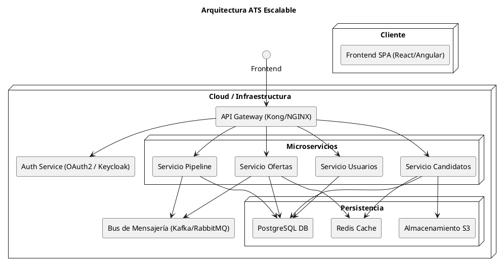

# Prompt 6 - Diseño de Alto Nivel

Propón el diseño de alto nivel para la arquitectura de un ATS escalable. Incluye componentes principales (frontend, backend, base de datos, API Gateway), tecnologías recomendadas, y justificación de las decisiones. Presenta el diagrama de arquitectura y explica cómo se integran los módulos.Dame el código PlantUML para el diseño

***
Aquí tienes el diseño de alto nivel para la arquitectura de un **ATS escalable**, con componentes, tecnologías recomendadas, justificación y el código PlantUML para el diagrama:

***

## ✅ **Componentes principales**

1.  **Frontend (SPA)**
    *   **Tecnología**: React o Angular
    *   **Justificación**: Alta interactividad, soporte para componentes reutilizables, integración con APIs REST/GraphQL.
2.  **Backend (Microservicios)**
    *   **Tecnología**: Node.js (Express) o Java (Spring Boot)
    *   **Justificación**: Escalabilidad horizontal, fácil integración con servicios externos, soporte para APIs REST y mensajería.
3.  **API Gateway**
    *   **Tecnología**: Kong, NGINX o AWS API Gateway
    *   **Justificación**: Centraliza autenticación, rate limiting, logging y enrutamiento hacia microservicios.
4.  **Base de datos**
    *   **Tecnología**: PostgreSQL (relacional) + Redis (caché)
    *   **Justificación**: PostgreSQL para consistencia y relaciones complejas; Redis para acelerar búsquedas y dashboards.
5.  **Servicios adicionales**
    *   **Mensajería**: RabbitMQ o Kafka para eventos (ej. notificaciones, actualizaciones de pipeline).
    *   **Almacenamiento**: S3 o Azure Blob para CVs y documentos.
    *   **Autenticación**: OAuth 2.0 / OpenID Connect (Keycloak, Auth0).

***

## ✅ **Integración de módulos**

*   **Frontend** consume APIs vía **API Gateway**.
*   **API Gateway** enruta hacia microservicios:
    *   **Servicio de Ofertas**
    *   **Servicio de Candidatos**
    *   **Servicio de Pipeline**
    *   **Servicio de Usuarios**
*   **Microservicios** acceden a la base de datos relacional y publican eventos en el bus de mensajería.
*   **Redis** se usa para caching de búsquedas y métricas.
*   **Almacenamiento externo** para archivos adjuntos (CVs).
*   **Auth Service** gestiona tokens y roles.

***

## ✅ **Código PlantUML para el diagrama de arquitectura**

***

### ✅ **Justificación de decisiones**

*   **Microservicios**: Permiten escalar módulos críticos (ej. pipeline) sin afectar otros.
*   **API Gateway**: Simplifica seguridad y balanceo.
*   **PostgreSQL + Redis**: Combina consistencia con velocidad.
*   **Mensajería**: Desacopla procesos (ej. envío de emails, actualizaciones en tiempo real).
*   **Almacenamiento externo**: Escalable para archivos grandes.
*   **OAuth2**: Estándar seguro para autenticación y autorización.

